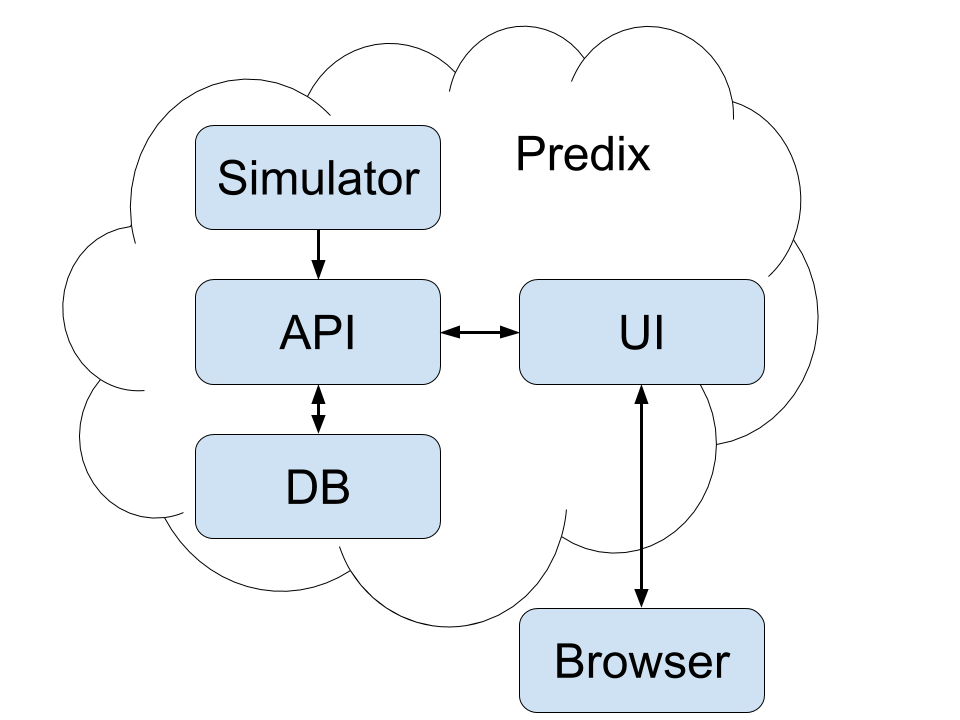

### Architecture

# Predix IoT Application

Application simulate sending data from sensors to Predix Cloud, preprocess, store and visualize historical data on UI.

## Prerequisites
* Git
* Node.js 4.x or higher with NPM 3.x or higher
* CF CLI
* Predix account
* Postgres

## First steps
* Clone the repo `git clone https://github.com/Altoros/predix-iot-application.git`
* Repository contains completed application at `master` branch.
* Open a `./simulator` in your code editor.

## Run locally
* Using the command line, create database `createdb predix-iot-application`
* Using the command line, navigate to the `./api` directory and install dependencies with `npm install`.
* Run the development server with `npm run dev`.
* In second terminal window navigate to the `./simulator` directory and install dependencies with `npm install`.
* Run the development server with `npm run dev`.
* In third terminal window navigate to the `./ui` directory and install dependencies with `npm install`.
* Run the development server with `npm run dev`. That should automatically launch the default web browser.

## Build and deploy api
* Stop `api` using hotkey Ctrl+C.
* Create a build artifact for deployment with `npm run build`.
* Update `host` in a `./api/manifest.yml` file.
* Navigate to Predix Catalog and create `SQL Database` and `Email Notification Framework` services.
* Deploy the application using the command line: `cf push`.

## Build and deploy simulator
* Stop `simulator` using hotkey Ctrl+C.
* Modify `./simulator/config/prod.env.js` with the URL of the deployed API.
* Create a build artifact for deployment with `npm run build`.
* Update `host` in a `./simulator/manifest.yml` file.
* Deploy the application using the command line: `cf push`.

## Build and deploy ui
* Stop `ui` using hotkey Ctrl+C.
* Modify `./ui/config/prod.env.js` with the URL of the deployed API.
* Create a build artifact for deployment with `npm run build`.
* Update `host` in a `./ui/manifest.yml` file.
* Deploy the application using the command line: `cf push`.
